  

---

## 🚀 About Me

Computer Engineering graduate passionate about **cybersecurity** and **artificial intelligence**. I build secure, intelligent systems at the intersection of AI, cybersecurity, and IoT.

I've been recognized in national hackathons and technical competitions, and I lead engineering initiatives within IEEE. Always curious, always learning, and open to meaningful collaborations.

---

## 🏆 Highlights

   
 &nbsp; **with Defensys**   
   
   

---

## 🛠️ Tech Stack

<table align="center">
  <tr>
    <td align="center" width="90"> C</td>
    <td align="center" width="90"> C++</td>
    <td align="center" width="90"> Python</td>
    <td align="center" width="90"> Kotlin</td>
    <td align="center" width="90"> JavaScript</td>
    <td align="center" width="90"> TypeScript</td>
    <td align="center" width="90"> PHP</td>
  </tr>
  <tr>
    <td align="center" width="90"> Flutter</td>
    <td align="center" width="90"> React</td>
    <td align="center" width="90"> Node.js</td>
    <td align="center" width="90"> FastAPI</td>
    <td align="center" width="90"> Tailwind</td>
    <td align="center" width="90"> TensorFlow</td>
    <td align="center" width="90"> Scikit-Learn</td>
  </tr>
  <tr>
    <td align="center" width="90"> PostgreSQL</td>
    <td align="center" width="90"> MySQL</td>
    <td align="center" width="90"> MongoDB</td>
    <td align="center" width="90"> Redis</td>
    <td align="center" width="90"> Docker</td>
    <td align="center" width="90"> K3s</td>
    <td align="center" width="90"> AWS</td>
  </tr>
  <tr>
    <td align="center" width="90"> Kali Linux</td>
    <td align="center" width="90"> Linux</td>
    <td align="center" width="90"> Arduino</td>
    <td align="center" width="90"> ESP32</td>
    <td align="center" width="90"> MQTT</td>
    <td align="center" width="90"> Git</td>
    <td align="center" width="90"> GitHub</td>
  </tr>
</table>

---

## 🎯 Featured Projects

| Project | Description | Stack |
|---|---|---|
| 🛡️ **IoT Security Sandbox** | A platform for simulating IoT devices, running attack scenarios, and auditing their defenses | `FastAPI` `Docker` `K3s` `Suricata` `QEMU` |
| 🧠 **Defensys** | An AI-powered platform for proactive application security | `AI` `Security` |
| 🏭 **Nexova** | A platform automating industrial processes with real-time IoT data integration | `Node.js` `TypeScript` `PostgreSQL` `Electron` |
| ✍️ **MNIST Digit Recognition** | A handwritten digit classifier served through an interactive web app | `Python` `TensorFlow` `React` |
| 🧊 **STL Web Viewer** | A web app for loading and visualizing large 3D STL files | `React` `Three.js` `TypeScript` |

---

## 🎓 Volunteer Experience

**Chair, IAS/IES/PES Joint Chapter** — *IEEE ESSTHS Student Branch*
Leading technical bootcamps and industrial visits for student members, and coordinating major chapter events.

---

## 📊 GitHub Stats

---

## 🌟 Beyond Code

Chess, trading, and Jiu Jitsu — I like pursuits that reward patience and clear thinking.

---

## 🌐 Connect With Me

📍 Tunis, Tunisia

